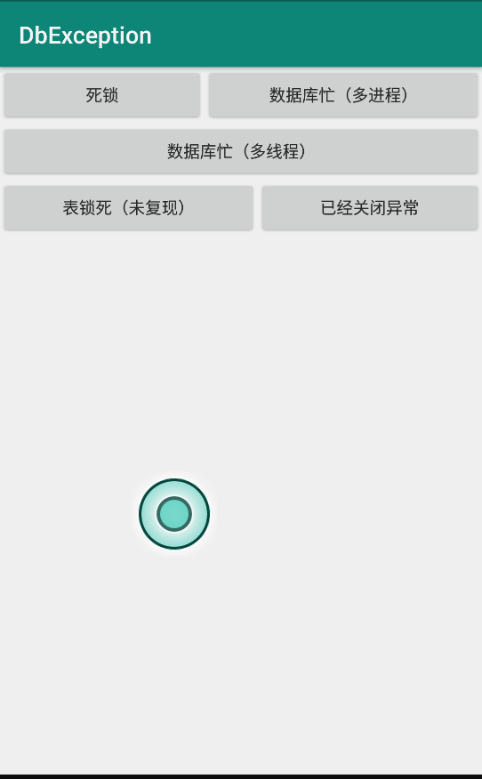

# DbException

#### 死锁
	//com.db.exception W/SQLiteConnectionPool: The connection pool for database '/data/user/0/com.db.exception/databases/my_db' has been unable to grant a connection to thread 15497 (Thread-2) with flags 0x2 for 30.005001 seconds.
	//    Connections: 0 active, 1 idle, 0 available.
	
#### 数据库忙（多线程，多进程使用不当都会发生）
	//android.database.sqlite.SQLiteDatabaseLockedException: database is locked
	

#### 表锁死
	该问题与死锁对应，但是我并没有复现出来

#### 已经关闭
	//java.lang.IllegalStateException: Cannot perform this operation because the connection pool has been closed.